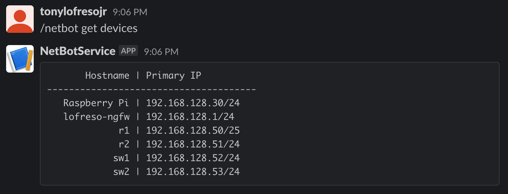

# netbot
A SlackBot for NetBox.
- netbot.py | Small flask app that receives POST calls from slack, and relays them to netbox



```
export SLACK_VERIFICATION_TOKEN=<verification_token>
export SLACK_TEAM_ID=<team_id>
export FLASK_APP=netbot.py

ngrok http 5000
```

[Handy Intro](https://renzolucioni.com/serverless-slash-commands-with-python/)